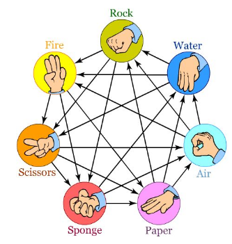

204498 วิศวกรรมบล๊อกเชน

# การบ้านที่ 3 | RWAPSSF #

### กําหนดส่ง: 13 กุมภาพันธ์ 2567 ก่อนเที่ยงคืน ###

ในการบ้านนี้เราจะมาเขียน smart contract โดยใช้ Solidity โดย smart contract นี้ผู้ใช้งานสามารถเล่นพนันในเกมส์ที่มีกฏเกณฑ์การแพ้ ชนะ และเสมอ ตายตัว และจะมีการจ่ายเงิน ETH ไปให้กับผู้ที่ชนะ หรือแบ่งเงินในกรณีเสมอ โดยอัตโนมัติ การ compile deploy และทดสอบตัว smart contrat จะทำผ่าน VM บน Remix IDE ที่สามารถเข้าใช้งานได้จากลิงค์ต่อไปนี้
https://remix.ethereum.org/


เริ่มต้นจากการศึกษาโค้ดสำหรับเกมส์พนัน Rock-Paper-Scissors (RPS) จากลิงค์ต่อไปนี้
https://github.com/parujr/RPS/blob/main/RPS.sol


วิดิโอการสอนที่มีการอธิบายและอภิปรายเกี่ยวกับโค้ดนี้ดูได้จากลิงค์ต่อไปนี้
https://ku-edu.webex.com/ku-edu/ldr.php?RCID=eca90c62c633dc7be0d4a838c1b49fe4


จากโค้ด RPS เราจะเห็นได้ว่ามันมีข้อบกพร่องด้านความปลอดภัยและความไม่สะดวกในการใช้งานดังต่อไปนี้
1. ไม่มีใครอยากจะเลือกก่อน เพราะว่ากลัวถูกอีกคนทำ front-running (การได้ประโยชน์จากการรู้ล่วงหน้าว่าคนหนึ่งเลือกอะไร)
2. ยากต่อการจะรู้ว่าเราใคร account ไหนเป็น idx ที่ 0 หรือ 1
3. เงินของ player 0 อาจถูกล๊อกไว้ ถ้าไม่มี player 1 มาลงขันต่อ
4. กรณีได้ player ทั้ง 2 แล้ว แต่มีเพียง player เดียวที่ลง choice มา แต่อีก player ไม่ยอมเรียก input function เพื่อส่ง choice มาให้ smart contract ได้ตัดสินแพ้ ชนะ เสมอ เช่นนี้ทำให้เงิน ETH ของทุกคนที่ลงขันมาถูกล็อกไว้โดยไม่มีใครถอนออกมาได้
5. ทำยังไงให้ contract นี้(มีการ transact กับมัน) ได้ในหลายๆ รอบโดยที่ไม่ต้องมีการ deploy ใหม่เสมอในทุกๆครั้งที่ต้องการเล่น


### สิ่งที่ต้องทำ ###
- Clone ตัว RPS github repo จากลิงค์ด้านบน แล้วทำการดัดแปลงโค้ด Solidity เพื่อแก้ปัญหาทั้ง 5 ข้อที่ได้กล่าวมา
- แก้ปัญหา front-running โดยใช้กระบวนการ commit-reveal (ตามที่เราได้คุยกันในเลคเชอร์เรื่อง cryptography) ขอให้ใช้โค้ด commit-reveal ที่ให้มาโดย import เข้ามาในโค้ด RPS หลัก เมื่อแก้ปัญหานี้ได้แล้ว ให้ทำ git commit แล้วเขียน commit message ที่เหมาะสม
- แก้ปัญหาการล๊อกเงิน ETH ที่ player ลงขันเข้ามา ให้กำหนดระยะเวลาว่าหลังจาก X minutes (หรือ hours หรือ days) ผ่านไปหลังจาก block.timestamp ที่มีการเรียก transaction ที่เกี่ยวข้อง ให้คืนเงิน ETH กลับไปให้ผู้เล่น
- หรือลงโทษผู้เล่นที่ไม่ทำตามกติกาโดยนำเงิน ETH ทั้งหมดให้กับผู้เล่นที่ทำตามกติกา เมื่อแก้ปัญหานี้ได้แล้ว ให้ทำ git commit แล้วเขียน commit message ที่เหมาะสม
- ทำให้เกมส์มีความซับซ้อนมากยิ่งขึ้น โดยแทนที่จะมีตัวเลือกแค่ Rock Paper และ Scissors 
เราจะเป็นเกมส์ที่มีตัวเลือก 7 ตัว Rock Water Air Paper Sponge Scissors และ Fire 

โดยมีกฏเกณฑ์การแพ้ ชนะ ดังต่อไปนี้
- ROCK POUNDS OUT FIRE, CRUSHES SCISSORS & SPONGE.
- FIRE MELTS SCISSORS, BURNS PAPER & SPONGE.
- SCISSORS SWISH THROUGH AIR, CUT PAPER & SPONGE.
- SPONGE SOAKS PAPER, USES AIR POCKETS, ABSORBS WATER.
- PAPER FANS AIR, COVERS ROCK, FLOATS ON WATER.
- AIR BLOWS OUT FIRE, ERODES ROCK, EVAPORATES WATER.
- WATER ERODES ROCK, PUTS OUT FIRE, RUSTS SCISSORS.

กราฟแสดงความสัมพันธ์การแพ้ ชนะ ของตัวเลือกทั้ง 7 เป็นไปตามแผนภาพต่อไปนี้


เปลี่ยนชื่อ contract และไฟล์จาก RPS(.sol)  เป็น RWAPSSF(.sol) หลังจากดัดแปลงโค้ด เปลี่ยนชื่อ contract และไฟล์ให้เหมาะสมแล้ว ให้ทำ git commit แล้วเขียน commit message ที่เหมาะสม

สร้างไฟล์ README.md เพื่ออธิบายแนวทางในการแก้ปัญหาความปลอดภัยและปรับปรุงโค้ดเดิมที่ให้มา และให้จับตัวอย่าง screenshot แสดงการทดสอบกรณที่มีผู้แพ้ชนะ และกรณีเสมอ

### การส่งงาน ###
ส่งลิงค์ Github repo ของ contract RWAPSSF มาที่ Google Classroom ของวิชาก่อนกําหนดส่ง โดย commit ล่าสุดจะต้องมี timestamp น้อยกว่าเวลากำหนดส่ง
Export README.md เป็น README.pdf และแนบไฟล์ pdf นี้ส่งมาด้วย

# My Approach

ในส่วนของ Struct Player ได้เพิ่ม bool isPlayed; เพื่อใช้เช็คว่า ผู้เล่นคนนั้นเล่นไปแล้วหรือยัง

```
struct Player {
        uint64 choice;
        bool isPlayed;
        address addr;
    }
```

เพิ่ม numShowedChoices เพื่อใช้เช็คการเปิดตัวเลือกที่เข้ารหัสด้วย salt เอาไว้ว่าทุกคนเปิดครบมั้ย\
เพิ่ม numShowedChoices เพื่อใช้เช็คการเปิดตัวเลือกที่เข้ารหัสด้วย salt เอาไว้ว่าทุกคนเปิดครบมั้ย

```
mapping (uint256 => Player) public player;
    uint256 public numPlayer = 0;
    uint256 public reward = 0;
    uint256 public numInput = 0;
    uint256 public numShowedChoices = 0;
    uint256 public ALLOWED_IDLE_TIME = 1 minutes;
    uint256 public lastActionTime = block.timestamp;
```
### _restGame()
ตั้งค่า public variable ให้กลับเป็นค่าเดิมยกเว้น ALLOWED_IDLE_TIME, lastActionTime\
ลบ address ของผู้เล่นทั้งสองคนออกด้วย delete player[0]; และ delete player[1];
```
function _resetGame() private {
        numPlayer = 0;
        reward = 0;
        numInput = 0;
        numShowedChoices = 0;
        delete player[0];
        delete player[1];
    }
```
### addPlayer()
สิ่งที่เพิ่มจากโค้ดเดิมได้แก่
- `emit playerAdded(numPlayer, msg.sender);` แสดง event playerAdded() เวลาฟังก์ชั่นนี้ถูกเรียกใช้
- `player[numPlayer].choice = 7;` เปลี่ยนเลข 3 เป็น 7 เพราะมี choice เพิ่มขึ้น
- `player[numPlayer].isPlayed = false;` เอา isPlayed ที่สร้างใหม่ใน struct มาตั้งสถานะเริ่มต้น
- `lastActionTime = block.timestamp;` เก็บเวลาที่บล็อกนี้ถูกเรียกใช้
- `event playerAdded(uint256 id, address addr);` 
```
function addPlayer() public payable {
    require(numPlayer < 2, "Maximum number of players reached");
    require(msg.value == 1 ether, "Incorrect payment amount");
    reward += msg.value;
    player[numPlayer].addr = msg.sender;
    emit playerAdded(numPlayer, msg.sender); // Now we know we added more player
    player[numPlayer].choice = 7; // 7 is used to catch players that don't play the game
    player[numPlayer].isPlayed = false;
    numPlayer++;
    lastActionTime = block.timestamp;
}

event playerAdded(uint256 id, address addr);
```
### getHashedChoiceWithSalt
- เอา Choice ที่เป็น `uint64` แทน `uint256` อันเดิม มา encrypt กับ `string memory salt` เพื่อเพิ่มความปลอดภัย ป้องกันคนมาแอบดูตัวเลือกของผู้เล่นคนก่อนหน้า
- ตั้งค่าเป็น `external` `pure`
- `bytes32 encodedSalt = bytes32(abi.encodePacked(salt));` เอา string salt มาเปลี่ยนเป็น byte32 หลังจาก encode แล้ว
- `return keccak256(abi.encodePacked(choice, encodedSalt));` เอาัวเลขที่ได้มา encode กับ choice ที่ผู้เล่นเลือกมา

```
// Encrypt input with salt

function getHashedChoiceWithSalt(uint64 choice, string memory salt) 
    external
    pure
    returns (bytes32)
{        bytes32 encodedSalt = bytes32(abi.encodePacked(salt));
    return keccak256(abi.encodePacked(choice, encodedSalt));
}
```
### Input_HashedChoice
- เปลี่ยน input จากเดิมที่รับ `uint256` มารับ `byte32` (ค่าที่ได้จากฟังก์ชชั่น `getHashedChoiceWithSalt()`)
- เรียกใช้ `getHash` event จาก CommitReveal.sol
- Update `lastActionTime` ให้ตรงกับเวลาปัจจุบัน
```
// Takes uint64 choices and turn it into encoded salt

function Input_HashedChoice(bytes32 hashed_salted_choice, uint256 idx) public  {
    require(numPlayer == 2, "Only playable if there are 2 players in total");
    require(msg.sender == player[idx].addr);
    require(player[idx].isPlayed == false, "This player has already played");
    require(idx == 0 || idx == 1, "Invalid player index");
    commit(getHash(hashed_salted_choice));
    numInput++;
    lastActionTime = block.timestamp;
}
```
### revealChoice
- รับค่า `uint64 choice` `string memory salt` `uint256 idx`
- เช็คเงื่อนไขสามประการ: 
    - จำนวนผู้เลนครบ 2 คนมั้ย `require(numPlayer == 2, "Only playable if there are 2 players in total");`
    - ผู้ใช้คำสั่งตรงกับผู้เล่นมั้ย `require(msg.sender == player[idx].addr);`
    - ตัวเลือกเป็นค่า 0-6 ซึ่งเราให้ `0 - Rock` `1 - Fire` `2 - Scissors` `3 - Sponge` `4 - Paper` `5 - Air` `6 - Water`
    - เรียกใช้ `reveal()` จาก CommitReveal.sol เพื่อเปลี่ยนจาก byte32 เป็นค่า uint256 ซึ่งเราเอาไปใช้ดูต่อได้
    - เรียกใช้ event `RevealChoice()`
    - Update `lastActionTime` ให้ตรงกับเวลาปัจจุบัน
    - เช็คว่าผู้เล่นเปิดตัวเลือกของตัวเองทั้งคู่รึยัง ถ้าเปิดแล้วก็เช็คผู้ชนะได้เลย 

```
function revealChoice(
        uint64 choice,
        string memory salt,
        uint256 idx
    ) public {
        require(numPlayer == 2, "Only playable if there are 2 players in total");
        require(msg.sender == player[idx].addr);
        require(idx == 0 || idx == 1, "Invalid player index");
        require(choice >= 0 && choice <= 6);
        bytes32 encodedSalt = bytes32(abi.encodePacked(salt));
        reveal(keccak256(abi.encodePacked(choice, encodedSalt)));
        player[idx].choice = choice;
        numShowedChoices++;
        emit RevealChoice(idx, choice);
        lastActionTime = block.timestamp;
        if (numShowedChoices == 2) {
            _checkWinnerAndPay();
        }
    }

    event RevealChoice(uint256 idx, uint256 choice);
```
### _checkWinnerAndPay()
-  สมการที่ใช้เช็คการแพ้ชนะคือ `diff = ( p1Choice + 7 - p0Choice ) % 7 ` เมื่อ `p0Choice` `p1Choice` คือตัวเลือกที่ถอดรหัสแล้วของ player คนแรกและคนที่สองตามลำดับ โดยถ้า
    - `diff == 0` = เสมอ
    - `diff > 3` = player[1] ชนะ
    - `diff <= 3` = player[0] ชนะ
- จ่ายเงินแล้วให้เรียก event `Winner`
- เริ่มเกมใหม่
```
function _checkWinnerAndPay() private {
        uint64 p0Choice = player[0].choice;
        uint64 p1Choice = player[1].choice;
        uint64 diff = ( p1Choice + 7 - p0Choice ) % 7;
        address payable account0 = payable(player[0].addr);
        address payable account1 = payable(player[1].addr);
        uint256 winner; // Winner Value & Meaning : 0 = player 0 wins, 1 = player 1 wins, 2 = draw

        if (diff == 0) {
            // to split reward
            account0.transfer(reward / 2);
            account1.transfer(reward / 2);
            winner = 2;
        }
        else if (diff > 3) {
            // to pay player[1]
            account1.transfer(reward);
            winner = 1;
        }
        else if (diff <= 3) {
            // to pay player[0]
            account0.transfer(reward);    
            winner = 0;
        }
        emit Winner(winner,p0Choice,p1Choice);
        _resetGame();
    }

    event Winner(uint256 Winner, uint64 p0Choice, uint64 p1Choice);
```
### gameUncomplete_returnMoney()
ใช้แก้ปัญหาเงินค้างในระบบเนื่องจากมีผู้เล่นไม่ใส่คำตอบ ไม่เปิดคำตอบ หรือไม่เข้าเกม ภายในเวลาที่กำหนด
- เช็คก่อนเลยว่าเวลาหมดหรือยังด้วย `require(block.timestamp - lastActionTime > ALLOWED_IDLE_TIME, "Still have time left!!!");`
- เช็คว่าเกมนี้มีผู้เล่นหรือไม่
- ต่อมาเป็นขั้นตอนการคืนเงิน 3 กรณี
    - มีผู้เล่นในเกมแค่คนเดียว
    - ทั้งคู่ไม่ใส่คำตอบให้ทันเวลา 
    - ทั้งคู่ไม่เปิดเผยคำตอบให้ทันเวลา 
- สุดท้ายเป็นกรณีที่จะลงโทษผู้เล่นที่
    - ไม่ใส่ตัวเลือกให้ทันเวลา 
    - ไม่เปิดเผยคำตอบให้ทันเวลา 
- เริ่มเกมใหม่

```
function gameUncomplete_returnMoney() public {
        // Timeout!
        require(block.timestamp - lastActionTime > ALLOWED_IDLE_TIME, "Still have time left!!!");
        require(numPlayer > 0, "There's no player in this game!");
        address payable account0 = payable(player[0].addr);
        address payable account1 = payable(player[1].addr);
        
        // return money if there's only one player has joined
        if (numPlayer == 1) {
            account0.transfer(reward);
            _resetGame();
        }

        // return money if both players not input their choice in time
        else if (numPlayer == 2 && numInput == 0) {
            account0.transfer(reward / 2);
            account1.transfer(reward / 2);
            _resetGame();
        }
        // return money if both players not revealed their choice in time
        else if (numPlayer == 2 && numInput == 2 && numShowedChoices == 0) {
            account0.transfer(reward / 2);
            account1.transfer(reward / 2);
            _resetGame();
        }
        // punish player who not input their choice in time
        else if (numPlayer == 2 && numInput == 1) {
            if (player[0].isPlayed == false) {
                // player 0 has not input their choice 
                account1.transfer(reward);
            } else if (player[1].isPlayed == false) {
                // player 1 has not input their choice
                account0.transfer(reward);
            }
            _resetGame();
        }
        // punish player who not revealed their choice in time
        else if (numPlayer == 2 && numShowedChoices == 1) {
            if (player[0].choice == 7) {
                // player 0 has not revealed their choice
                account1.transfer(reward);
            } else if (player[1].choice == 7) {
                // player 1 has not revealed their choice
                account0.transfer(reward);
            }
            _resetGame();
        }
    }
```


